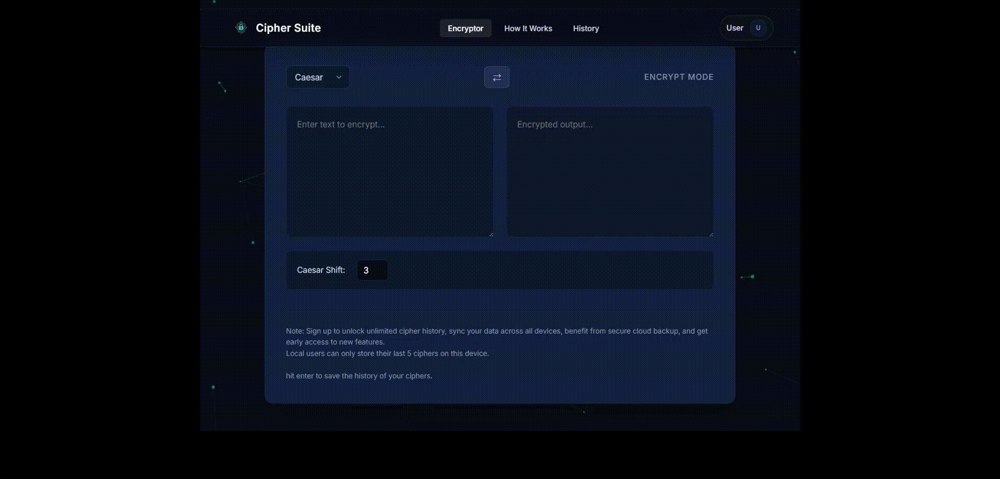
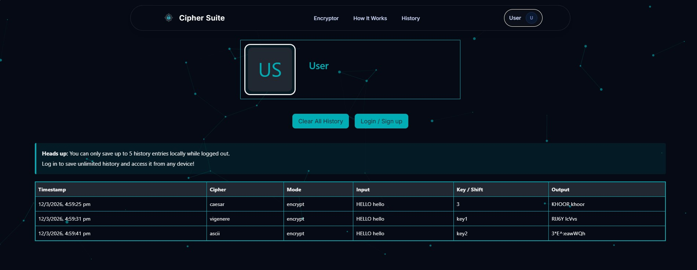
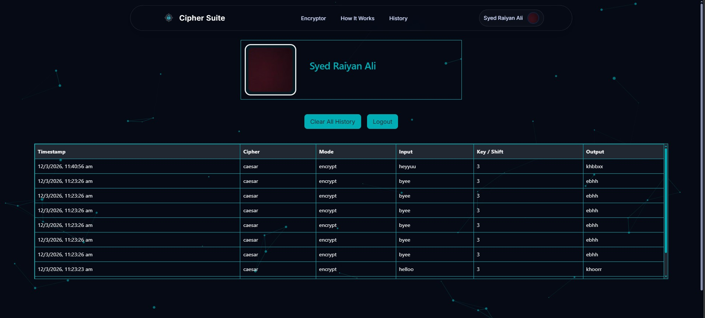

# Cipher Suite: The Sophisticated Encryption Engine

[](https://cipher-suite16.web.app/)

**Cipher Suite** is a premium, editorial-grade web application designed for exploring and executing classic cryptography. Built with a focus on modern aesthetics and fluid user experience, it features a glassmorphic design system and high-performance interactive animations.

[**🚀 View Live Demo**](https://cipher-suite16.web.app/)

---

## ✨ Features

- **State-Based Section Swapper:** Uses a robust state-driven architecture for seamless transitions between tools and landing pages, providing a true Single Page Application (SPA) feel without the lag of traditional routing or carousels.
- **Sophisticated Editorial UI:** A bespoke design system featuring deep navy tones, glassmorphism, and elegant typography (`Inter`), optimized for readability and professional aesthetics.
- **Interactive Particle Background:** A high-density, performance-optimized background powered by `tsParticles` that reacts to user interactions (clicks and hovers).
- **Secure Cloud History:** Full Google Authentication integration allows users to sync their encryption history across multiple devices.
- **History Limits Notice:** Smart context-aware alerts notify guests of local storage limits, encouraging secure cloud backup via login.

---

## 📸 Screenshots & Demo

### 🔐 Encryption Tools in Action
> Showcasing the live encryption flow across all three supported cipher tools — **Caesar**, **Vigenere**, and **ASCII** — in a single seamless demo.



---

### 🌐 App Walkthrough — How It Works & History
> A full scroll-through of the landing page, featuring the interactive **"How It Works"** section and the rich **"History of Ciphers"** educational content.


---

### 👤 User Profile — Guest vs. Authenticated

| Not Logged In | Logged In |
|:---:|:---:|
|  |  |
| Guest users see only their **5 most recent** local cipher history entries with a prompt to sign in for cloud sync. | Authenticated users enjoy **unlimited history**, synced securely via **Supabase** and accessible across all devices. |

---

## 🛠️ Tech Stack

- **React 19:** Building block for the reactive UI components.
- **Vite:** Next-gen build tool for high-speed development and optimized production bundles.
- **Tailwind CSS & PostCSS:** Utility-first styling combined with custom vanilla CSS modules for precise editorial control.
- **Framer Motion & Micro-animations:** Powering the fluid transitions and interactive element states.
- **Firebase:** Integrated for **Authentication** and **Hosting** the production deployment.
- **Supabase:** PostgreSQL-backed cloud database used to store and retrieve user cipher history across devices.
- **tsParticles:** Interactive canvas engine for sophisticated visual effects.

---

## 💻 Local Setup

1. **Clone & Enter:**
   ```bash
   git clone https://github.com/syed-raiyan-ali/Cipher-Suite.git
   cd cipher-app
   ```

2. **Install Dependencies:**
   ```bash
   npm install
   ```

3. **Run Dev Server:**
   ```bash
   npm run dev
   ```
   Open `http://localhost:5173` to view the app.

---

## 🚀 Deployment

To build and deploy the project to Firebase Hosting:

1. **Build the Production Bundle:**
   ```bash
   npm run build
   ```
   *This creates a minified, optimized `dist/` folder.*

2. **Deploy to Firebase:**
   ```bash
   firebase deploy --only hosting
   ```
   *Note: Ensure you have initialized your project with `firebase init` if deploying for the first time.*

---

## 📄 License
This project is open-source. Feel free to explore and build upon the cryptographic implementations.
